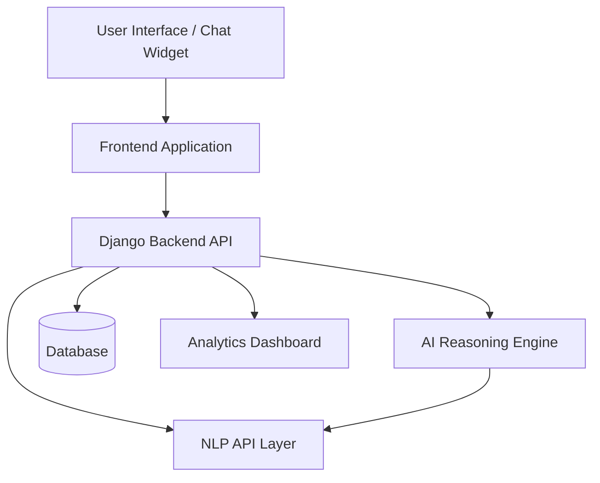

# SAHA AI


**SAHA AI** is an AI-powered conversational advisory platform designed to provide intelligent recommendations, automated guidance, and natural language interaction through modern NLP models.

The platform acts as a **modular AI backend** capable of powering chat assistants, advisory systems, and intelligent dashboards that can integrate into websites, applications, or enterprise systems.

SAHA AI focuses on building a **scalable AI assistant infrastructure** rather than just a single chatbot.

---

# Project Vision

Modern applications increasingly require **intelligent conversational layers**.

SAHA AI aims to provide a backend platform where developers can quickly integrate:

* AI chat assistants
* advisory or recommendation engines
* NLP-powered services
* intelligent dashboards
* conversational APIs

The system separates **AI reasoning, NLP processing, and application logic** so new AI models or APIs can be integrated without rewriting the core backend.

---

# Key Capabilities

## Conversational AI

Supports AI-powered interactions through modern NLP APIs.

Capabilities include:

* conversational response generation
* contextual interaction
* advisory decision support
* natural language queries

---

## Modular AI Backend

The platform is designed as a **service-oriented architecture** where different components manage different responsibilities:

* user management
* AI reasoning modules
* NLP integration
* chat interface support
* dashboard integration

This allows developers to easily extend the system.

---

## Dashboard Integration

SAHA AI supports integration with monitoring dashboards for:

* AI usage analytics
* model performance tracking
* conversation insights
* API health monitoring

---

## Chat Widget Support

A frontend example is provided showing how the assistant can be embedded into websites.

Developers can quickly plug the AI assistant into any web interface.

---

# System Architecture



### Architecture Explanation

**Frontend Layer**
Handles the chat widget or application interface interacting with users.

**Backend Layer**
Django backend that manages API routing, user sessions, and AI workflows.

**AI Reasoning Layer**
Processes advisory logic and decision-making mechanisms.

**NLP Integration Layer**
Communicates with external AI/NLP APIs for language understanding and response generation.

**Database Layer**
Stores user data, conversation logs, and configuration.

**Dashboard Layer**
Provides monitoring and analytics for system usage.

---

# Project Structure

```
saha-ai
│
├── advisor/                  
│   AI advisory logic and reasoning modules
│
├── core/                     
│   Core Django project configuration
│
├── users/                    
│   User authentication and management
│
├── scripts/                  
│   Utility scripts and setup helpers
│
├── CHAT_WIDGET_EXAMPLE.html  
│   Example frontend chat widget
│
├── list_models.py            
│   Lists available AI models
│
├── test_nlp_api.py           
│   Tests connectivity with NLP services
│
├── manage.py                 
│   Django project entry point
│
├── requirements.txt          
│   Python dependencies
│
├── API_KEYS_SETUP.md
├── NLP_API_SETUP.md
├── NLP_COMPLETE_GUIDE.md
├── GEMINI_DASHBOARD_GUIDE.md
├── GEMINI_DASHBOARD_INTEGRATION.md
├── DEPLOYMENT_COMPLETE.md
└── VERIFICATION_REPORT.md
```

---

# Installation

Clone the repository

```
git clone https://github.com/nithin1906/saha-ai.git
cd saha-ai
```

Create virtual environment

```
python -m venv venv
```

Activate environment

Linux / Mac

```
source venv/bin/activate
```

Windows

```
venv\Scripts\activate
```

Install dependencies

```
pip install -r requirements.txt
```

---

# Environment Configuration

Before running the system, configure API keys.

Follow the guide:

```
API_KEYS_SETUP.md
```

For NLP integration:

```
NLP_API_SETUP.md
```

---

# Running the Server

Start the development server:

```
python manage.py runserver
```

The API will run locally and can accept chat or AI requests.

---

# Testing NLP Integration

Test the NLP connection:

```
python test_nlp_api.py
```

View available models:

```
python list_models.py
```

---

# Chat Widget Integration

A basic frontend integration example is provided.

Open:

```
CHAT_WIDGET_EXAMPLE.html
```

This demonstrates how a webpage can communicate with the backend AI assistant.

---

# Dashboard Integration

The system supports Gemini-based dashboards.

See the documentation:

```
GEMINI_DASHBOARD_GUIDE.md
GEMINI_DASHBOARD_INTEGRATION.md
```

---

# Deployment

Deployment and verification instructions are available in:

```
DEPLOYMENT_COMPLETE.md
VERIFICATION_REPORT.md
```

These documents include steps for configuring the system in production environments.

---

# Future Roadmap

Planned improvements include:

* additional AI model integrations
* improved conversational memory
* multi-agent advisory systems
* real-time analytics dashboards
* scalable microservice deployment
* frontend dashboard UI

---

# Author

Nithin N

---

# Contributing

Contributions, improvements, and feature suggestions are welcome.

Fork the repository and submit a pull request.
